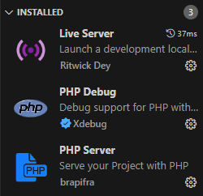
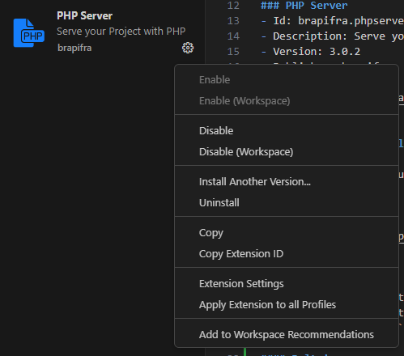
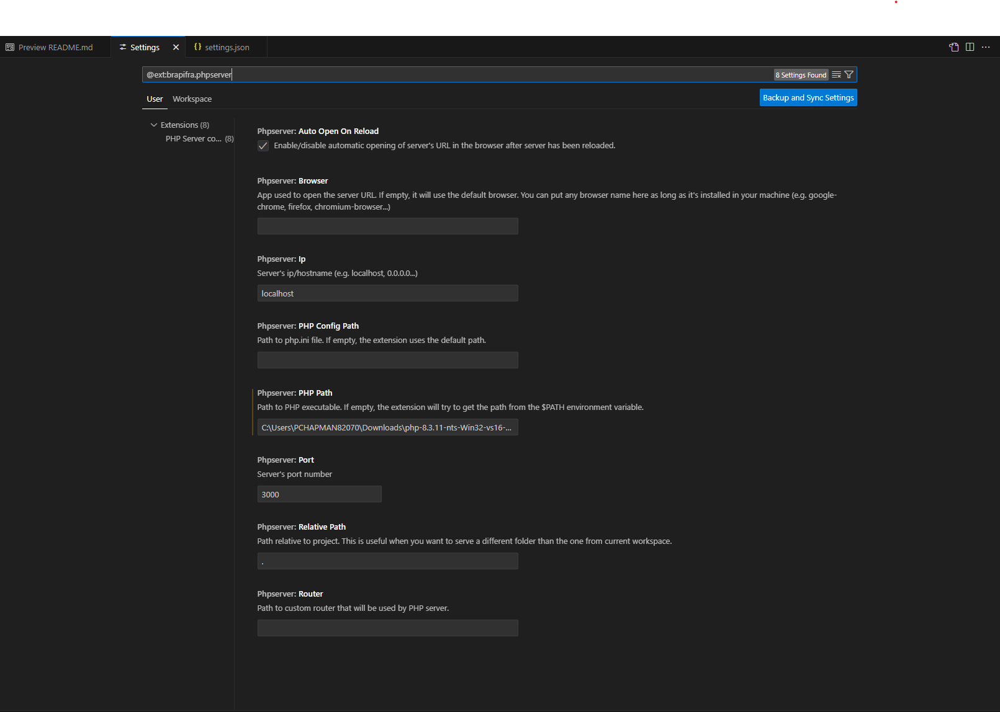
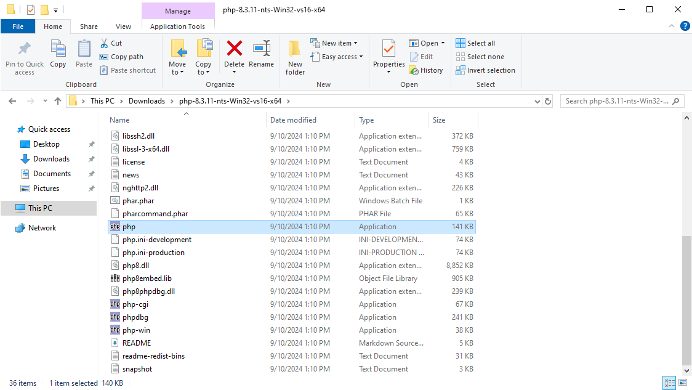

# PHP Example

This is an example for how to run PHP locally on a machine using only VS Code

## PHP
A download of php is needed for this to work.
https://windows.php.net/download/

## Extensions
These are the extensions that need to be downloaded for this project to work.

### PHP Server
- Id: brapifra.phpserver
- Description: Serve your Project with PHP
- Version: 3.0.2
- Publisher: brapifra
- VS Marketplace Link: https://marketplace.visualstudio.com/items?itemName=brapifra.phpserver


### PHP Debug (Optional)
- Id: xdebug.php-debug
- Description: Debug support for PHP with Xdebug
- Version: 1.35.0
- Publisher: Xdebug
- VS Marketplace Link: https://marketplace.visualstudio.com/items?itemName=xdebug.php-debug

### Settings

There are two options to set the settings;
1. Built in editing within VS Code
2. Editing the VScode `settings.json` file. 

#### Bult in
Navigate to your extensions and click the settings for PHP server



Select Extension settings within the drop down.



Within the settings change the PHP path to the path to the downloaded exe.



Make sure to extract the zip from https://windows.php.net/download/ and then locate the `php.exe` file, copy the path of this file and place it in the settings.

Example:

`C:\path\to\your\php\exe\php.exe`

Make sure that it ends with `php.exe`




#### Settings JSON

Run the following command:

`f1` or `ctrl+shift+p` and type `open settings`, `select Open User Settings (JSON)`

Adjust the JSON to match what is bellow

Example:
```json
{
    "php.validate.executablePath": "C:\\path\\to\\your\\php\\exe\\php.exe",
    "phpserver.phpPath": "C:\\path\\to\\your\\php\\exe\\php.exe",
    "php.debug.executablePath": "C:\\path\\to\\your\\php\\exe\\php.exe"
}
```